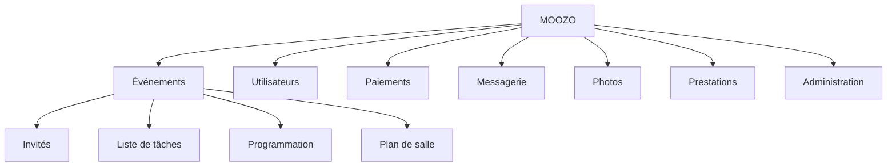

# PBS - Product Breakdown Structure

```mermaid
flowchart TD
    moozo["MOOZO"]
    moozo --> evenements["Événements"]
    moozo --> utilisateurs["Utilisateurs"]
    moozo --> paiements["Paiements"]
    moozo --> messagerie["Messagerie"]
    moozo --> photos["Photos"]
    moozo --> prestations["Prestations"]
    moozo --> administration["Administration"]

    evenements --> invites["Invités"]
    evenements --> taches["Liste de tâches"]
    evenements --> programmation["Programmation"]
    evenements --> salle["Plan de salle"]
```
