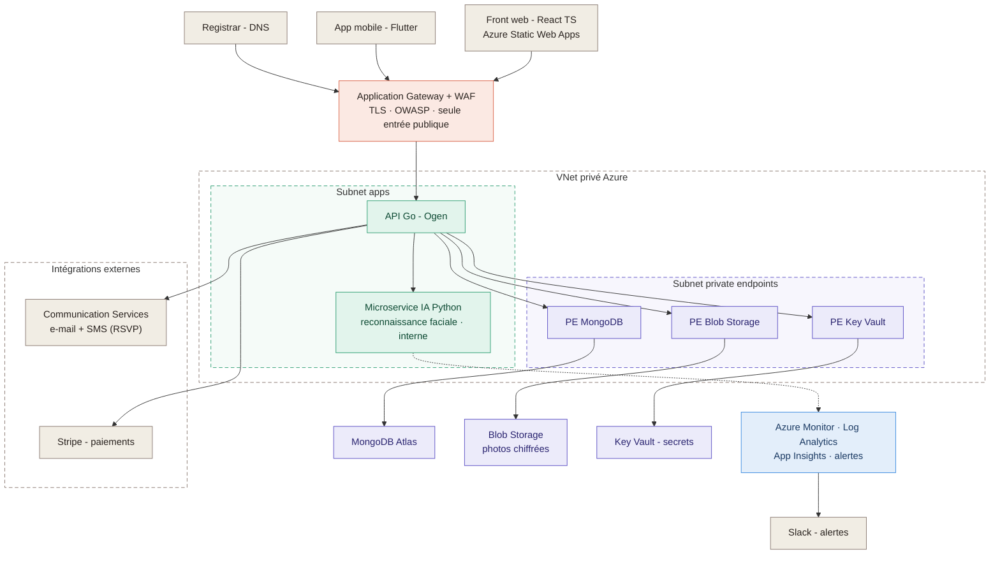

# Architecture technique

```mermaid
flowchart TD
    web["Front web - React TS<br/>Azure Static Web Apps"]
    mobile["App mobile - Flutter"]
    dns["Registrar - DNS"]

    web --> gw
    mobile --> gw
    dns --> gw

    gw["Application Gateway + WAF<br/>TLS · OWASP · seule entrée publique"]

    subgraph vnet["VNet privé Azure"]
        subgraph apps["Subnet apps"]
            api["API Go - Ogen"]
            ia["Microservice IA Python<br/>reconnaissance faciale · interne"]
            api --> ia
        end
        subgraph pe["Subnet private endpoints"]
            pemongo["PE MongoDB"]
            peblob["PE Blob Storage"]
            pekv["PE Key Vault"]
        end
    end

    gw --> api
    api --> pemongo
    api --> peblob
    api --> pekv

    mongo["MongoDB Atlas"]
    blob["Blob Storage<br/>photos chiffrées"]
    kv["Key Vault - secrets"]
    pemongo --> mongo
    peblob --> blob
    pekv --> kv

    monitor["Azure Monitor · Log Analytics<br/>App Insights · alertes"]
    slack["Slack - alertes"]
    ia -.-> monitor
    monitor --> slack

    subgraph ext["Intégrations externes"]
        comm["Communication Services<br/>e-mail + SMS (RSVP)"]
        stripe["Stripe - paiements"]
    end
    api --> comm
    api --> stripe
    comm ~~~ stripe

    style vnet fill:#ffffff,stroke:#8a7a72,stroke-dasharray:6 4
    style apps fill:#f5fbf8,stroke:#2f9e73,stroke-dasharray:6 4
    style pe fill:#f7f6fd,stroke:#5b4fc4,stroke-dasharray:6 4
    style ext fill:#ffffff,stroke:#8a7a72,stroke-dasharray:6 4

    classDef public fill:#f1ede4,stroke:#8a7a72,color:#2b2420
    classDef gateway fill:#fbe9e3,stroke:#d9644a,color:#2b2420
    classDef app fill:#e2f4ec,stroke:#2f9e73,color:#0d4a33
    classDef private fill:#ecebfa,stroke:#5b4fc4,color:#2a2470
    classDef obs fill:#e3eefa,stroke:#3b8be0,color:#1b3a63
    class web,mobile,dns,slack,comm,stripe public
    class gw gateway
    class api,ia app
    class pemongo,peblob,pekv,mongo,blob,kv private
    class monitor obs
```
