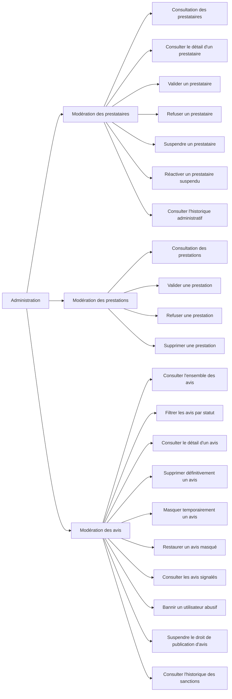

# WBS - Administration

```mermaid
flowchart LR
    n0["Administration"]
    n0 --> n1["Modération des prestataires"]
    n1 --> n2["Consultation des prestataires"]
    n1 --> n3["Consulter le détail d'un prestataire"]
    n1 --> n4["Valider un prestataire"]
    n1 --> n5["Refuser un prestataire"]
    n1 --> n6["Suspendre un prestataire"]
    n1 --> n7["Réactiver un prestataire suspendu"]
    n1 --> n8["Consulter l'historique administratif"]
    n0 --> n9["Modération des prestations"]
    n9 --> n10["Consultation des prestations"]
    n9 --> n11["Valider une prestation"]
    n9 --> n12["Refuser une prestation"]
    n9 --> n13["Supprimer une prestation"]
    n0 --> n14["Modération des avis"]
    n14 --> n15["Consulter l'ensemble des avis"]
    n14 --> n16["Filtrer les avis par statut"]
    n14 --> n17["Consulter le détail d'un avis"]
    n14 --> n18["Supprimer définitivement un avis"]
    n14 --> n19["Masquer temporairement un avis"]
    n14 --> n20["Restaurer un avis masqué"]
    n14 --> n21["Consulter les avis signalés"]
    n14 --> n22["Bannir un utilisateur abusif"]
    n14 --> n23["Suspendre le droit de publication d'avis"]
    n14 --> n24["Consulter l'historique des sanctions"]
```
