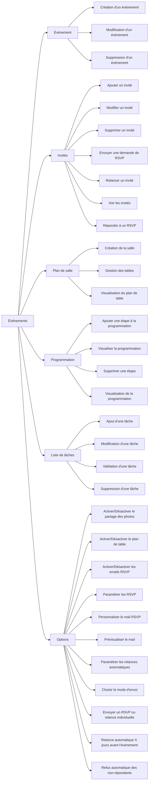

# WBS - Événements

```mermaid
flowchart LR
    n0["Événements"]
    n0 --> n1["Événement"]
    n1 --> n2["Création d'un événement"]
    n1 --> n3["Modification d'un événement"]
    n1 --> n4["Suppression d'un événement"]
    n0 --> n5["Invités"]
    n5 --> n6["Ajouter un invité"]
    n5 --> n7["Modifier un invité"]
    n5 --> n8["Supprimer un invité"]
    n5 --> n9["Envoyer une demande de RSVP"]
    n5 --> n10["Relancer un invité"]
    n5 --> n11["Voir les invités"]
    n5 --> n12["Répondre à un RSVP"]
    n0 --> n13["Plan de salle"]
    n13 --> n14["Création de la salle"]
    n13 --> n15["Gestion des tables"]
    n13 --> n16["Visualisation du plan de table"]
    n0 --> n17["Programmation"]
    n17 --> n18["Ajouter une étape à la programmation"]
    n17 --> n19["Visualiser la programmation"]
    n17 --> n20["Supprimer une étape"]
    n17 --> n21["Visualisation de la programmation"]
    n0 --> n22["Liste de tâches"]
    n22 --> n23["Ajout d'une tâche"]
    n22 --> n24["Modification d'une tâche"]
    n22 --> n25["Validation d'une tâche"]
    n22 --> n26["Suppression d'une tâche"]
    n0 --> n27["Options"]
    n27 --> n28["Activer/Désactiver le partage des photos"]
    n27 --> n29["Activer/Désactiver le plan de table"]
    n27 --> n30["Activer/Désactiver les emails RSVP"]
    n27 --> n31["Paramétrer les RSVP"]
    n27 --> n32["Personnaliser le mail RSVP"]
    n27 --> n33["Prévisualiser le mail"]
    n27 --> n34["Paramétrer les relances automatiques"]
    n27 --> n35["Choisir le mode d'envoi"]
    n27 --> n36["Envoyer un RSVP ou relance individuelle"]
    n27 --> n37["Relance automatique X jours avant l'événement"]
    n27 --> n38["Refus automatique des non-répondants"]
```
