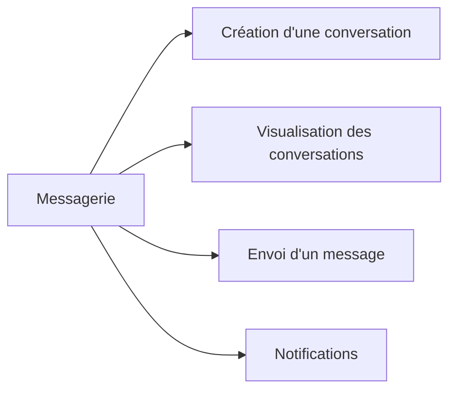

# WBS - Messagerie

```mermaid
flowchart LR
    n0["Messagerie"]
    n0 --> n1["Création d'une conversation"]
    n0 --> n2["Visualisation des conversations"]
    n0 --> n3["Envoi d'un message"]
    n0 --> n4["Notifications"]
```
