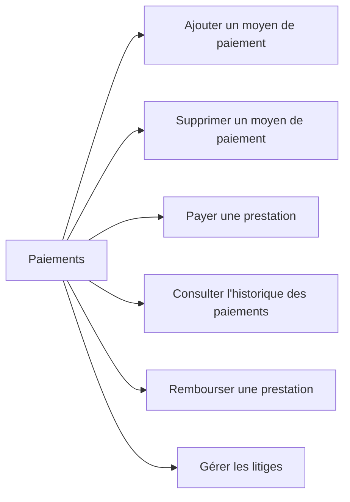

# WBS - Paiements

```mermaid
flowchart LR
    n0["Paiements"]
    n0 --> n1["Ajouter un moyen de paiement"]
    n0 --> n2["Supprimer un moyen de paiement"]
    n0 --> n3["Payer une prestation"]
    n0 --> n4["Consulter l'historique des paiements"]
    n0 --> n5["Rembourser une prestation"]
    n0 --> n6["Gérer les litiges"]
```
