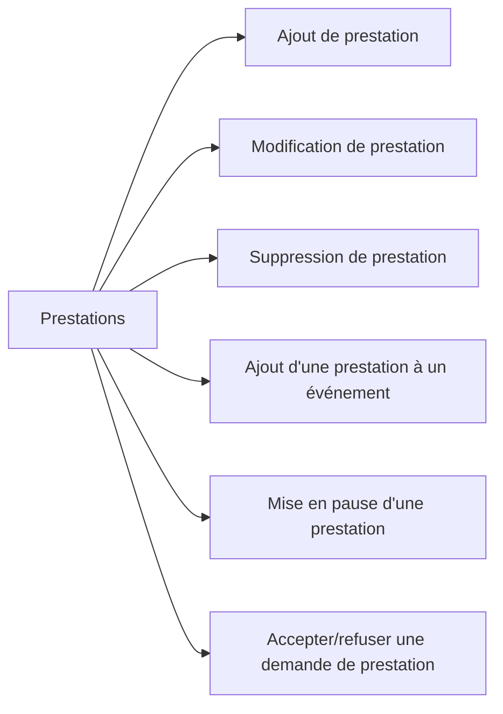

# WBS - Prestations

```mermaid
flowchart LR
    n0["Prestations"]
    n0 --> n1["Ajout de prestation"]
    n0 --> n2["Modification de prestation"]
    n0 --> n3["Suppression de prestation"]
    n0 --> n4["Ajout d'une prestation à un événement"]
    n0 --> n5["Mise en pause d'une prestation"]
    n0 --> n6["Accepter/refuser une demande de prestation"]
```
