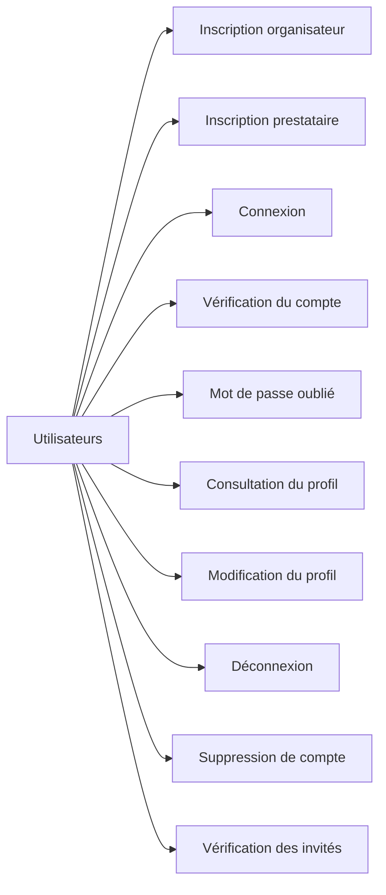

# WBS - Utilisateurs

```mermaid
flowchart LR
    n0["Utilisateurs"]
    n0 --> n1["Inscription organisateur"]
    n0 --> n1b["Inscription prestataire"]
    n0 --> n2["Connexion"]
    n0 --> n3["Vérification du compte"]
    n0 --> n4["Mot de passe oublié"]
    n0 --> n5["Consultation du profil"]
    n0 --> n6["Modification du profil"]
    n0 --> n7["Déconnexion"]
    n0 --> n8["Suppression de compte"]
    n0 --> n9["Vérification des invités"]
```
